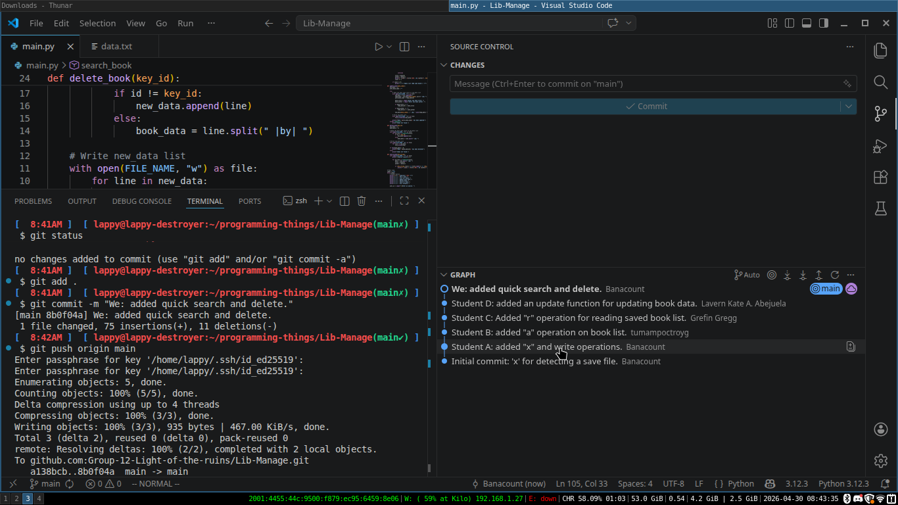

```text
 _      ____  ____          ___ ___   ____  ____    ____   ____    ___ 
| |    |    ||    \        |   |   | /    ||    \  /    | /    |  /  _]
| |     |  | |  o  ) _____ | _   _ ||  o  ||  _  ||  o  ||   __| /  [_ 
| |___  |  | |     ||     ||  \_/  ||     ||  |  ||     ||  |  ||    _]
|     | |  | |  O  ||_____||   |   ||  _  ||  |  ||  _  ||  |_ ||   [_ 
|     | |  | |     |       |   |   ||  |  ||  |  ||  |  ||     ||     |
|_____||____||_____|       |___|___||__|__||__|__||__|__||___,_||_____|
```
A mini library system written in python that let's you manage
your books through the terminal easily. You can compile this
code by just running the main.py file using the python compiler.

### Supported Operations
* Adding books.
* View the list of books in a indexed format.
* Deleting books by index.
* Updating and Searching.

### Git Snapshot (Contributors)
